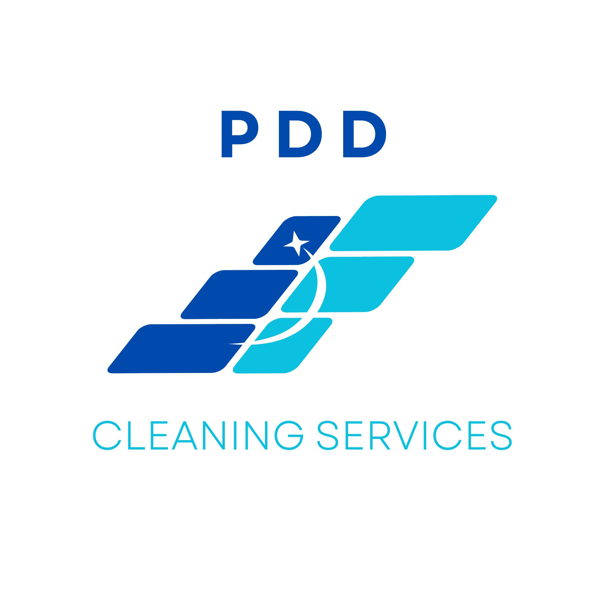

# PDD Cleaning Services — CRM Endpoint Website Code
CRM website enquiry endpoint applied: `https://pdd-pink.vercel.app/api/website-enquiry`.
Remaining placeholders are intentionally left for launch/legal setup.

## index.html

```html
<!DOCTYPE html>
<html lang="en">
<head>
<meta charset="UTF-8" />
<meta name="viewport" content="width=device-width, initial-scale=1.0" />
<title>PDD Cleaning Services — Cleaning Services in Enfield & North London</title>
<meta name="description" content="End of tenancy cleaning, deep cleaning, builders cleans, exterior windows and jet washing across Enfield & North London." />
<meta property="og:title" content="PDD Cleaning Services — Cleaning Services in Enfield & North London" />
<meta property="og:description" content="End of tenancy cleaning, deep cleaning, builders cleans, exterior windows and jet washing across Enfield & North London." />
<meta property="og:type" content="website" />
<meta property="og:url" content="https://pddcleaningservices.co.uk" />
<meta property="og:image" content="https://pddcleaningservices.co.uk/logo.jpg" />
<link rel="icon" href="favicon.ico" />
<link rel="stylesheet" href="styles.css" />
<script type="application/ld+json">
{
  "@context": "https://schema.org",
  "@type": "CleaningService",
  "name": "PDD Cleaning Services",
  "legalName": "PDD Services Limited",
  "url": "https://pddcleaningservices.co.uk",
  "logo": "https://pddcleaningservices.co.uk/logo.jpg",
  "telephone": "+447568273696",
  "email": "info@pddcleaningservices.co.uk",
  "areaServed": ["Enfield", "Southgate", "Winchmore Hill", "Bounds Green", "Palmers Green", "Wood Green", "Edmonton", "North London"],
  "description": "Cleaning services across Enfield and North London.",
  "hasOfferCatalog": {
    "@type": "OfferCatalog",
    "name": "Cleaning services",
    "itemListElement": [
      {"@type": "Offer", "itemOffered": {"@type": "Service", "name": "End of Tenancy Cleaning"}},
      {"@type": "Offer", "itemOffered": {"@type": "Service", "name": "Deep Cleaning"}},
      {"@type": "Offer", "itemOffered": {"@type": "Service", "name": "Oven Cleaning Add-on"}},
      {"@type": "Offer", "itemOffered": {"@type": "Service", "name": "Interior Window Cleaning Add-on"}},
      {"@type": "Offer", "itemOffered": {"@type": "Service", "name": "Exterior Window Cleaning"}},
      {"@type": "Offer", "itemOffered": {"@type": "Service", "name": "Jet Washing"}},
      {"@type": "Offer", "itemOffered": {"@type": "Service", "name": "Builders Clean"}}
    ]
  },
  "address": {
    "@type": "PostalAddress",
    "addressLocality": "Enfield",
    "addressRegion": "London",
    "addressCountry": "GB"
  }
}
</script>
</head>
<body>
<a class="skip-link" href="#main-content">Skip to content</a>
<header class="site-header">
  <div class="container header-inner">
    <a class="brand" href="index.html" aria-label="PDD Cleaning Services home">
      
    </a>
    <nav class="nav" aria-label="Main navigation">
      <a href="index.html">Home</a>
      <a href="services.html">Services</a>
      <a href="about.html">About</a>
      <a href="contact.html">Contact</a>
    </nav>
    <div class="header-actions">
      <a class="phone-link" href="tel:07568273696">07568 273696</a>
      <a class="btn small" href="contact.html#quote-form">Get Quote</a>
      <button class="menu-toggle" aria-label="Toggle menu" aria-expanded="false" aria-controls="mobile-menu">
        <svg viewBox="0 0 24 24" aria-hidden="true"><path d="M4 7h16M4 12h16M4 17h16" stroke-linecap="round"/></svg>
      </button>
    </div>
  </div>
  <div class="container mobile-menu-shell" id="mobile-menu">
    <div class="mobile-menu-inner">
      <nav class="mobile-nav" aria-label="Mobile navigation">
        <a href="index.html">Home</a>
        <a href="services.html">Services</a>
        <a href="about.html">About</a>
        <a href="contact.html">Contact</a>
      </nav>
      <div class="mobile-cta-row">
        <a class="btn secondary" href="tel:07568273696">Call</a>
        <a class="btn" href="contact.html#quote-form">Get Quote</a>
      </div>
    </div>
  </div>
</header>
<main id="main-content">

<section class="hero">
  <div class="container hero-grid">
    <div class="hero-copy reveal">
      <div class="eyebrow">Local cleaning across Enfield & North London</div>
      <h1>Cleaning services across Enfield & North London</h1>
      <p class="lead">End of tenancy and deep cleaning, with oven and internal window add-ons. Exterior windows, jet washing and builders cleans also available.</p>
      <div class="hero-actions">
        <a class="btn" href="contact.html#quote-form">Get a Free Quote</a>
        <a class="btn secondary" href="tel:07568273696">Call / Message Us</a>
      </div>
      <div class="trust-row" aria-label="Trust points">
        <span class="trust-chip"><span>✓</span> Fully insured</span>
        <span class="trust-chip"><span>✓</span> Vetted cleaners</span>
        <span class="trust-chip"><span>✓</span> Clear quote before booking</span>
        <span class="trust-chip"><span>✓</span> 48-hour re-clean guarantee</span>
      </div>
    </div>
    <aside class="hero-form-card reveal" id="quote-form" aria-label="Quick quote form">
      <h2>Get a quote in seconds</h2>
      <p class="form-sub">Name, number and a short message. We’ll ask for anything else after.</p>
      <form class="quick-form" action="https://pdd-pink.vercel.app/api/website-enquiry" method="POST">
  <label class="form-label">Name
    <input type="text" name="name" autocomplete="name" required />
  </label>
  <label class="form-label">Phone
    <input type="tel" name="phone" autocomplete="tel" required />
  </label>
  <label class="form-label">Enquiry
    <textarea name="message" placeholder="Example: End of tenancy clean, 2-bed flat in Enfield, needed next week." required></textarea>
  </label>
  <label class="consent">
    <input type="checkbox" name="contact_consent" value="Agreed" required />
    <span>I agree for PDD Cleaning Services to contact me about my quote request.</span>
  </label>
  <button class="btn full" type="submit">Send Quote Request</button>
  <p class="form-note">No prices published online. We confirm a clear quote before booking.</p>
</form>
    </aside>
  </div>
</section>

<section class="section-white section-tight">
  <div class="container">
    <div class="section-header center reveal">
      <h2>Choose a service</h2>
      <p>Click a service to see what is included before you enquire.</p>
    </div>
    <div class="picker-grid">
      <a class="picker-card reveal" href="services.html#end-of-tenancy"><span class="icon-badge" aria-hidden="true"><svg viewBox="0 0 24 24"><path d="M20 6 9 17l-5-5"/></svg></span><span><strong>End of Tenancy Cleaning</strong><p>Checklist-based move-out cleaning for tenants, landlords and agents.</p></span></a>
      <a class="picker-card reveal" href="services.html#deep-cleaning"><span class="icon-badge" aria-hidden="true"><svg viewBox="0 0 24 24"><path d="M20 6 9 17l-5-5"/></svg></span><span><strong>Deep Cleaning</strong><p>A one-off clean for homes that need a proper reset.</p></span></a>
      <a class="picker-card reveal" href="services.html#builders-clean"><span class="icon-badge" aria-hidden="true"><svg viewBox="0 0 24 24"><path d="M20 6 9 17l-5-5"/></svg></span><span><strong>Builders Clean</strong><p>After-renovation dust, surfaces and final clean-up.</p></span></a>
      <a class="picker-card reveal" href="services.html#exterior-windows"><span class="icon-badge" aria-hidden="true"><svg viewBox="0 0 24 24"><path d="M20 6 9 17l-5-5"/></svg></span><span><strong>Exterior Windows</strong><p>External window cleaning for suitable properties.</p></span></a>
      <a class="picker-card reveal" href="services.html#jet-washing"><span class="icon-badge" aria-hidden="true"><svg viewBox="0 0 24 24"><path d="M20 6 9 17l-5-5"/></svg></span><span><strong>Jet Washing</strong><p>Patios, driveways, paths and outdoor surfaces.</p></span></a>
      <a class="picker-card reveal" href="services.html#add-ons"><span class="icon-badge" aria-hidden="true"><svg viewBox="0 0 24 24"><path d="M20 6 9 17l-5-5"/></svg></span><span><strong>Oven & Interior Window Add-ons</strong><p>Add to end of tenancy or deep cleaning where needed.</p></span></a>
    </div>
  </div>
</section>

<section class="section-soft section-tight">
  <div class="container">
    <div class="section-header center reveal">
      <h2>Why book with PDD?</h2>
      <p>Simple communication, clear scope and a proper checklist before work starts.</p>
    </div>
    <div class="grid grid-4 proof-grid">
      <article class="card proof-card reveal"><h3>Clear quote</h3><p>We confirm the service, area, access and condition before booking.</p></article>
      <article class="card proof-card reveal"><h3>Vetted cleaners</h3><p>Jobs are fulfilled by cleaners reviewed before being assigned work.</p></article>
      <article class="card proof-card reveal"><h3>Checklist-led</h3><p>Each service has a defined scope so expectations are clearer.</p></article>
      <article class="card proof-card reveal"><h3>48-hour guarantee</h3><p>If an agreed area is missed, contact us within 48 hours with photos.</p></article>
    </div>
  </div>
</section>

<section class="section-white section-tight">
  <div class="container">
    <div class="section-header center reveal"><h2>How it works</h2></div>
    <div class="grid grid-3">
      <article class="card step-card reveal"><div class="step-number">1</div><h3>Send a quick enquiry</h3><p>Tell us the service, area and when you need it.</p></article>
      <article class="card step-card reveal"><div class="step-number">2</div><h3>We confirm the quote</h3><p>You receive a clear quote and what is included.</p></article>
      <article class="card step-card reveal"><div class="step-number">3</div><h3>The clean is completed</h3><p>A vetted cleaner attends and works to the agreed checklist.</p></article>
    </div>
  </div>
</section>

<section class="section-soft section-tight">
  <div class="container center-text reveal">
    <h2>Areas covered</h2>
    <p class="lead" style="margin-inline:auto;">Enfield, Southgate, Winchmore Hill, Bounds Green, Palmers Green, Wood Green, Edmonton and nearby North London areas.</p>
    <div class="area-list">
      <span class="area-chip">Enfield</span><span class="area-chip">Southgate</span><span class="area-chip">Winchmore Hill</span><span class="area-chip">Palmers Green</span><span class="area-chip">Wood Green</span><span class="area-chip">Edmonton</span>
    </div>
  </div>
</section>

<section class="section-white section-tight">
  <div class="container">
    <div class="review-placeholder reveal">
      <div><h2 style="font-size:1.6rem;">Google reviews</h2><p style="margin-top:8px;">Google reviews will appear here once available.</p></div>
    </div>
  </div>
</section>

<section class="section-tight">
  <div class="container">
    <div class="cta-band reveal">
      <h2>Need a cleaning quote?</h2>
      <p>Send your name, number and what you need cleaned. We’ll reply with the next step.</p>
      <div class="hero-actions">
        <a class="btn secondary" href="contact.html#quote-form">Get a Free Quote</a>
        <a class="btn ghost" href="tel:07568273696">Call / Message Us</a>
      </div>
    </div>
  </div>
</section>

</main>
<footer class="site-footer">
  <div class="container footer-grid">
    <div class="footer-brand">
      
      <p>Cleaning services across Enfield & North London.</p>
    </div>
    <div class="footer-col">
      <h4>Services</h4>
      <a href="services.html#end-of-tenancy">End of tenancy</a>
      <a href="services.html#deep-cleaning">Deep cleaning</a>
      <a href="services.html#builders-clean">Builders clean</a>
      <a href="services.html#exterior-windows">Exterior windows</a>
    </div>
    <div class="footer-col">
      <h4>Contact</h4>
      <a href="tel:07568273696">07568 273696</a>
      <a href="mailto:info@pddcleaningservices.co.uk">info@pddcleaningservices.co.uk</a>
      <a href="[GOOGLE BUSINESS PROFILE LINK]">Google Business Profile</a>
    </div>
    <div class="footer-col">
      <h4>Legal</h4>
      <a href="privacy.html">Privacy Policy</a>
      <a href="terms.html">Terms of Service</a>
    </div>
  </div>
  <div class="container footer-bottom">
    PDD Cleaning Services is a trading name of PDD Services Limited, company number [COMPANY NUMBER], registered in England & Wales.
  </div>
</footer>
<script src="script.js"></script>
</body>
</html>

```

## services.html

```html
<!DOCTYPE html>
<html lang="en">
<head>
<meta charset="UTF-8" />
<meta name="viewport" content="width=device-width, initial-scale=1.0" />
<title>Services — PDD Cleaning Services</title>
<meta name="description" content="Cleaning services and checklists across Enfield & North London including end of tenancy, deep cleaning, builders cleans, exterior windows and jet washing." />
<meta property="og:title" content="Services — PDD Cleaning Services" />
<meta property="og:description" content="Cleaning services and checklists across Enfield & North London including end of tenancy, deep cleaning, builders cleans, exterior windows and jet washing." />
<meta property="og:type" content="website" />
<meta property="og:url" content="https://pddcleaningservices.co.uk" />
<meta property="og:image" content="https://pddcleaningservices.co.uk/logo.jpg" />
<link rel="icon" href="favicon.ico" />
<link rel="stylesheet" href="styles.css" />
<script type="application/ld+json">
{
  "@context": "https://schema.org",
  "@type": "CleaningService",
  "name": "PDD Cleaning Services",
  "legalName": "PDD Services Limited",
  "url": "https://pddcleaningservices.co.uk",
  "logo": "https://pddcleaningservices.co.uk/logo.jpg",
  "telephone": "+447568273696",
  "email": "info@pddcleaningservices.co.uk",
  "areaServed": ["Enfield", "Southgate", "Winchmore Hill", "Bounds Green", "Palmers Green", "Wood Green", "Edmonton", "North London"],
  "description": "Cleaning services across Enfield and North London.",
  "hasOfferCatalog": {
    "@type": "OfferCatalog",
    "name": "Cleaning services",
    "itemListElement": [
      {"@type": "Offer", "itemOffered": {"@type": "Service", "name": "End of Tenancy Cleaning"}},
      {"@type": "Offer", "itemOffered": {"@type": "Service", "name": "Deep Cleaning"}},
      {"@type": "Offer", "itemOffered": {"@type": "Service", "name": "Oven Cleaning Add-on"}},
      {"@type": "Offer", "itemOffered": {"@type": "Service", "name": "Interior Window Cleaning Add-on"}},
      {"@type": "Offer", "itemOffered": {"@type": "Service", "name": "Exterior Window Cleaning"}},
      {"@type": "Offer", "itemOffered": {"@type": "Service", "name": "Jet Washing"}},
      {"@type": "Offer", "itemOffered": {"@type": "Service", "name": "Builders Clean"}}
    ]
  },
  "address": {
    "@type": "PostalAddress",
    "addressLocality": "Enfield",
    "addressRegion": "London",
    "addressCountry": "GB"
  }
}
</script>
</head>
<body>
<a class="skip-link" href="#main-content">Skip to content</a>
<header class="site-header">
  <div class="container header-inner">
    <a class="brand" href="index.html" aria-label="PDD Cleaning Services home">
      
    </a>
    <nav class="nav" aria-label="Main navigation">
      <a href="index.html">Home</a>
      <a href="services.html">Services</a>
      <a href="about.html">About</a>
      <a href="contact.html">Contact</a>
    </nav>
    <div class="header-actions">
      <a class="phone-link" href="tel:07568273696">07568 273696</a>
      <a class="btn small" href="contact.html#quote-form">Get Quote</a>
      <button class="menu-toggle" aria-label="Toggle menu" aria-expanded="false" aria-controls="mobile-menu">
        <svg viewBox="0 0 24 24" aria-hidden="true"><path d="M4 7h16M4 12h16M4 17h16" stroke-linecap="round"/></svg>
      </button>
    </div>
  </div>
  <div class="container mobile-menu-shell" id="mobile-menu">
    <div class="mobile-menu-inner">
      <nav class="mobile-nav" aria-label="Mobile navigation">
        <a href="index.html">Home</a>
        <a href="services.html">Services</a>
        <a href="about.html">About</a>
        <a href="contact.html">Contact</a>
      </nav>
      <div class="mobile-cta-row">
        <a class="btn secondary" href="tel:07568273696">Call</a>
        <a class="btn" href="contact.html#quote-form">Get Quote</a>
      </div>
    </div>
  </div>
</header>
<main id="main-content">

<section class="page-hero">
  <div class="container reveal">
    <div class="eyebrow">Services & checklists</div>
    <h1>See what is included before you book.</h1>
    <p class="lead">Choose the service you need and check the likely scope. Every job is confirmed before booking, so there are no unclear expectations.</p>
    <div class="hero-actions">
      <a class="btn" href="contact.html#quote-form">Get a Free Quote</a>
      <a class="btn secondary" href="tel:07568273696">Call / Message Us</a>
    </div>
  </div>
</section>

<section class="section-white section-tight">
  <div class="container">
    <div class="section-header center reveal"><h2>Pick a service</h2><p>Jump straight to the checklist.</p></div>
    <div class="picker-grid">
      <a class="picker-card reveal" href="#end-of-tenancy"><span class="icon-badge" aria-hidden="true"><svg viewBox="0 0 24 24"><path d="M20 6 9 17l-5-5"/></svg></span><span><strong>End of Tenancy Cleaning</strong><p>Move-out clean with oven and interior window add-ons.</p></span></a>
      <a class="picker-card reveal" href="#deep-cleaning"><span class="icon-badge" aria-hidden="true"><svg viewBox="0 0 24 24"><path d="M20 6 9 17l-5-5"/></svg></span><span><strong>Deep Cleaning</strong><p>One-off deep clean with optional oven and interior windows.</p></span></a>
      <a class="picker-card reveal" href="#builders-clean"><span class="icon-badge" aria-hidden="true"><svg viewBox="0 0 24 24"><path d="M20 6 9 17l-5-5"/></svg></span><span><strong>Builders Clean</strong><p>After works, renovation or decorating dust.</p></span></a>
      <a class="picker-card reveal" href="#exterior-windows"><span class="icon-badge" aria-hidden="true"><svg viewBox="0 0 24 24"><path d="M20 6 9 17l-5-5"/></svg></span><span><strong>Exterior Window Cleaning</strong><p>Outside glass and frames where safely accessible.</p></span></a>
      <a class="picker-card reveal" href="#jet-washing"><span class="icon-badge" aria-hidden="true"><svg viewBox="0 0 24 24"><path d="M20 6 9 17l-5-5"/></svg></span><span><strong>Jet Washing</strong><p>Patios, driveways and hard outdoor surfaces.</p></span></a>
      <a class="picker-card reveal" href="#add-ons"><span class="icon-badge" aria-hidden="true"><svg viewBox="0 0 24 24"><path d="M20 6 9 17l-5-5"/></svg></span><span><strong>Oven & Interior Window Add-ons</strong><p>Add to end of tenancy or deep cleaning.</p></span></a>
    </div>
  </div>
</section>

<section class="section-soft section-tight">
  <div class="container">
    <article class="card service-detail reveal" id="end-of-tenancy">
      <div class="detail-head">
        <div class="eyebrow">Move-out cleaning</div>
        <h2>End of Tenancy Cleaning</h2>
        <p>For tenants, landlords, letting agents and property managers who need a property cleaned before inspection, handover or re-letting.</p>
        <div class="detail-meta"><span class="meta-pill">Checklist-based</span><span class="meta-pill">48-hour re-clean guarantee</span><span class="meta-pill">Add oven / interior windows</span></div>
        <a class="btn" href="contact.html#quote-form">Request quote</a>
      </div>
      <div class="checklist-wrap two">
        <div class="checklist-box"><h3>Kitchen</h3><ul class="checklist"><li>Worktops, splashbacks and accessible surfaces cleaned</li><li>Cupboards and drawers cleaned where empty and accessible</li><li>Sink, taps, hob and extractor exterior cleaned</li><li>Appliance exteriors cleaned; fridge/freezer interior if empty and agreed</li><li>Floor vacuumed and mopped; skirting wiped where accessible</li></ul></div>
        <div class="checklist-box"><h3>Bathrooms</h3><ul class="checklist"><li>Toilet, sink, bath, shower and taps cleaned</li><li>Shower screen, tiles and mirrors cleaned</li><li>Limescale treated where reasonably removable</li><li>Extractor, fixtures and accessible surfaces wiped</li><li>Floor vacuumed and mopped</li></ul></div>
        <div class="checklist-box"><h3>Rooms & hallway</h3><ul class="checklist"><li>Accessible surfaces dusted and wiped</li><li>Doors, handles, switches and sockets wiped</li><li>Wardrobes and cupboards cleaned where empty</li><li>Skirting, radiators and window sills wiped where accessible</li><li>Floors vacuumed and mopped where suitable</li></ul></div>
        <div class="checklist-box"><h3>Common move-out details</h3><ul class="checklist"><li>Cobwebs removed from accessible areas</li><li>Bins emptied where agreed</li><li>Before/after photos taken where appropriate</li><li>Final check against the agreed cleaning scope</li><li>Oven and interior windows added if selected</li></ul></div>
      </div>
      <div class="scope-note">Scope note: the quote depends on size, condition, access and add-ons. Permanent staining, damage, heavy mould, unsafe access and rubbish removal are not included unless specifically agreed.</div>
    </article>

    <article class="card service-detail reveal" id="deep-cleaning">
      <div class="detail-head">
        <div class="eyebrow">One-off home clean</div>
        <h2>Deep Cleaning</h2>
        <p>For homes that need a more detailed one-off clean than a standard regular clean.</p>
        <div class="detail-meta"><span class="meta-pill">One-off reset</span><span class="meta-pill">Priority areas agreed</span><span class="meta-pill">Add oven / interior windows</span></div>
        <a class="btn" href="contact.html#quote-form">Request quote</a>
      </div>
      <div class="checklist-wrap two">
        <div class="checklist-box"><h3>Kitchen</h3><ul class="checklist"><li>Worktops, cupboard fronts and accessible surfaces cleaned</li><li>Sink, taps, hob and splashback cleaned</li><li>Appliance exteriors wiped</li><li>Floor vacuumed and mopped</li></ul></div>
        <div class="checklist-box"><h3>Bathroom</h3><ul class="checklist"><li>Toilet, sink, bath and shower cleaned</li><li>Mirrors, taps and fittings polished</li><li>Tiles and screens cleaned where accessible</li><li>Floor vacuumed and mopped</li></ul></div>
        <div class="checklist-box"><h3>Living areas & bedrooms</h3><ul class="checklist"><li>Surfaces dusted and wiped</li><li>Skirting, doors and handles wiped where accessible</li><li>Furniture exteriors dusted</li><li>Floors vacuumed and mopped where suitable</li></ul></div>
        <div class="checklist-box"><h3>Optional priorities</h3><ul class="checklist"><li>Interior windows added if selected</li><li>Oven added if selected</li><li>Extra attention to agreed problem areas</li><li>Before/after photos where useful</li></ul></div>
      </div>
      <div class="scope-note">Scope note: deep cleans are quoted around the property and priorities. Heavy clutter, unsafe access and specialist stain removal may need a revised scope.</div>
    </article>

    <article class="card service-detail reveal" id="builders-clean">
      <div class="detail-head">
        <div class="eyebrow">After works</div>
        <h2>Builders Clean</h2>
        <p>For properties after decorating, refurbishment, maintenance works or small renovation projects.</p>
        <div class="detail-meta"><span class="meta-pill">Post-work dust</span><span class="meta-pill">Surface clean</span><span class="meta-pill">Final freshen-up</span></div>
        <a class="btn" href="contact.html#quote-form">Request quote</a>
      </div>
      <div class="checklist-wrap two">
        <div class="checklist-box"><h3>Dust removal</h3><ul class="checklist"><li>Accessible surfaces dusted and wiped</li><li>Skirting, doors, switches and handles wiped</li><li>Window sills and ledges wiped where accessible</li><li>Floors vacuumed using suitable equipment</li></ul></div>
        <div class="checklist-box"><h3>Rooms</h3><ul class="checklist"><li>Kitchen and bathroom surfaces cleaned</li><li>Fixtures and fittings wiped</li><li>Internal glass spot-cleaned where agreed</li><li>Final mop of suitable hard floors</li></ul></div>
        <div class="checklist-box"><h3>Finish</h3><ul class="checklist"><li>Light paint/plaster marks removed where reasonably possible</li><li>Work areas checked against agreed scope</li><li>Before/after photos where appropriate</li><li>Ready-for-use freshen-up</li></ul></div>
        <div class="checklist-box"><h3>Not usually included</h3><ul class="checklist"><li>Large rubble or waste removal unless quoted</li><li>Hazardous material or unsafe debris</li><li>Specialist high-level cleaning</li><li>Damage repair or paint correction</li></ul></div>
      </div>
      <div class="scope-note">Scope note: builders cleans vary heavily. Photos before quoting help confirm the right time, team and scope.</div>
    </article>

    <article class="card service-detail reveal" id="exterior-windows">
      <div class="detail-head">
        <div class="eyebrow">Outside glass</div>
        <h2>Exterior Window Cleaning</h2>
        <p>For exterior windows on suitable properties across Enfield and North London.</p>
        <div class="detail-meta"><span class="meta-pill">External glass</span><span class="meta-pill">Frames/sills where accessible</span><span class="meta-pill">Safe access only</span></div>
        <a class="btn" href="contact.html#quote-form">Request quote</a>
      </div>
      <div class="checklist-wrap two">
        <div class="checklist-box"><h3>Included</h3><ul class="checklist"><li>External window glass cleaned</li><li>Frames and sills wiped where safe and accessible</li><li>Ground-floor and suitable upper windows confirmed before booking</li><li>Final visual check where practical</li></ul></div>
        <div class="checklist-box"><h3>Before booking</h3><ul class="checklist"><li>Confirm property type and access</li><li>Confirm front/rear access and gates</li><li>Confirm parking or loading if needed</li><li>Send photos for unusual access</li></ul></div>
      </div>
      <div class="scope-note">Scope note: we only quote work that can be completed safely. High-level, restricted or specialist-access windows may require a different arrangement.</div>
    </article>

    <article class="card service-detail reveal" id="jet-washing">
      <div class="detail-head">
        <div class="eyebrow">Outdoor surfaces</div>
        <h2>Jet Washing</h2>
        <p>For patios, driveways, paths and hard outdoor surfaces that need a clean refresh.</p>
        <div class="detail-meta"><span class="meta-pill">Patios</span><span class="meta-pill">Driveways</span><span class="meta-pill">Paths</span></div>
        <a class="btn" href="contact.html#quote-form">Request quote</a>
      </div>
      <div class="checklist-wrap two">
        <div class="checklist-box"><h3>Included</h3><ul class="checklist"><li>Loose debris cleared from the working area</li><li>Pressure clean of agreed hard surface</li><li>Edges and obvious build-up targeted where possible</li><li>Final rinse down of the cleaned area</li></ul></div>
        <div class="checklist-box"><h3>Before booking</h3><ul class="checklist"><li>Confirm approximate size and surface type</li><li>Check outside water access</li><li>Confirm drainage and access</li><li>Photos requested for accurate quoting</li></ul></div>
      </div>
      <div class="scope-note">Scope note: results depend on surface age, staining, drainage and condition. Oil, paint, rust and deep staining may not fully lift.</div>
    </article>

    <article class="card service-detail reveal" id="add-ons">
      <div class="detail-head">
        <div class="eyebrow">Add-ons</div>
        <h2>Oven & Interior Window Add-ons</h2>
        <p>Add these to an end of tenancy clean or deep clean when the property needs a more complete finish.</p>
        <div class="detail-meta"><span class="meta-pill">Oven cleaning</span><span class="meta-pill">Interior windows</span><span class="meta-pill">Quoted before booking</span></div>
        <a class="btn" href="contact.html#quote-form">Request add-ons</a>
      </div>
      <div class="checklist-wrap two">
        <div class="checklist-box"><h3>Oven cleaning</h3><ul class="checklist"><li>Oven door, glass and accessible interior cleaned</li><li>Racks and trays cleaned where removable</li><li>Hob and extractor exterior cleaned if agreed</li><li>Final wipe and check</li></ul></div>
        <div class="checklist-box"><h3>Interior windows</h3><ul class="checklist"><li>Internal glass cleaned</li><li>Interior window sills wiped</li><li>Frames wiped where accessible</li><li>Obvious marks targeted where reasonably removable</li></ul></div>
      </div>
      <div class="scope-note">Scope note: add-ons should be requested before booking so the cleaner has enough time and the quote is clear.</div>
    </article>
  </div>
</section>

<section class="section-tight">
  <div class="container">
    <div class="cta-band reveal">
      <h2>Ready to check availability?</h2>
      <p>Send a short enquiry with the service, postcode, property size and preferred date.</p>
      <div class="hero-actions"><a class="btn secondary" href="contact.html#quote-form">Get a Free Quote</a><a class="btn ghost" href="tel:07568273696">Call / Message Us</a></div>
    </div>
  </div>
</section>

</main>
<footer class="site-footer">
  <div class="container footer-grid">
    <div class="footer-brand">
      
      <p>Cleaning services across Enfield & North London.</p>
    </div>
    <div class="footer-col">
      <h4>Services</h4>
      <a href="services.html#end-of-tenancy">End of tenancy</a>
      <a href="services.html#deep-cleaning">Deep cleaning</a>
      <a href="services.html#builders-clean">Builders clean</a>
      <a href="services.html#exterior-windows">Exterior windows</a>
    </div>
    <div class="footer-col">
      <h4>Contact</h4>
      <a href="tel:07568273696">07568 273696</a>
      <a href="mailto:info@pddcleaningservices.co.uk">info@pddcleaningservices.co.uk</a>
      <a href="[GOOGLE BUSINESS PROFILE LINK]">Google Business Profile</a>
    </div>
    <div class="footer-col">
      <h4>Legal</h4>
      <a href="privacy.html">Privacy Policy</a>
      <a href="terms.html">Terms of Service</a>
    </div>
  </div>
  <div class="container footer-bottom">
    PDD Cleaning Services is a trading name of PDD Services Limited, company number [COMPANY NUMBER], registered in England & Wales.
  </div>
</footer>
<script src="script.js"></script>
</body>
</html>

```

## about.html

```html
<!DOCTYPE html>
<html lang="en">
<head>
<meta charset="UTF-8" />
<meta name="viewport" content="width=device-width, initial-scale=1.0" />
<title>About — PDD Cleaning Services</title>
<meta name="description" content="PDD Cleaning Services is a local cleaning service covering Enfield and North London." />
<meta property="og:title" content="About — PDD Cleaning Services" />
<meta property="og:description" content="PDD Cleaning Services is a local cleaning service covering Enfield and North London." />
<meta property="og:type" content="website" />
<meta property="og:url" content="https://pddcleaningservices.co.uk" />
<meta property="og:image" content="https://pddcleaningservices.co.uk/logo.jpg" />
<link rel="icon" href="favicon.ico" />
<link rel="stylesheet" href="styles.css" />
<script type="application/ld+json">
{
  "@context": "https://schema.org",
  "@type": "CleaningService",
  "name": "PDD Cleaning Services",
  "legalName": "PDD Services Limited",
  "url": "https://pddcleaningservices.co.uk",
  "logo": "https://pddcleaningservices.co.uk/logo.jpg",
  "telephone": "+447568273696",
  "email": "info@pddcleaningservices.co.uk",
  "areaServed": ["Enfield", "Southgate", "Winchmore Hill", "Bounds Green", "Palmers Green", "Wood Green", "Edmonton", "North London"],
  "description": "Cleaning services across Enfield and North London.",
  "hasOfferCatalog": {
    "@type": "OfferCatalog",
    "name": "Cleaning services",
    "itemListElement": [
      {"@type": "Offer", "itemOffered": {"@type": "Service", "name": "End of Tenancy Cleaning"}},
      {"@type": "Offer", "itemOffered": {"@type": "Service", "name": "Deep Cleaning"}},
      {"@type": "Offer", "itemOffered": {"@type": "Service", "name": "Oven Cleaning Add-on"}},
      {"@type": "Offer", "itemOffered": {"@type": "Service", "name": "Interior Window Cleaning Add-on"}},
      {"@type": "Offer", "itemOffered": {"@type": "Service", "name": "Exterior Window Cleaning"}},
      {"@type": "Offer", "itemOffered": {"@type": "Service", "name": "Jet Washing"}},
      {"@type": "Offer", "itemOffered": {"@type": "Service", "name": "Builders Clean"}}
    ]
  },
  "address": {
    "@type": "PostalAddress",
    "addressLocality": "Enfield",
    "addressRegion": "London",
    "addressCountry": "GB"
  }
}
</script>
</head>
<body>
<a class="skip-link" href="#main-content">Skip to content</a>
<header class="site-header">
  <div class="container header-inner">
    <a class="brand" href="index.html" aria-label="PDD Cleaning Services home">
      
    </a>
    <nav class="nav" aria-label="Main navigation">
      <a href="index.html">Home</a>
      <a href="services.html">Services</a>
      <a href="about.html">About</a>
      <a href="contact.html">Contact</a>
    </nav>
    <div class="header-actions">
      <a class="phone-link" href="tel:07568273696">07568 273696</a>
      <a class="btn small" href="contact.html#quote-form">Get Quote</a>
      <button class="menu-toggle" aria-label="Toggle menu" aria-expanded="false" aria-controls="mobile-menu">
        <svg viewBox="0 0 24 24" aria-hidden="true"><path d="M4 7h16M4 12h16M4 17h16" stroke-linecap="round"/></svg>
      </button>
    </div>
  </div>
  <div class="container mobile-menu-shell" id="mobile-menu">
    <div class="mobile-menu-inner">
      <nav class="mobile-nav" aria-label="Mobile navigation">
        <a href="index.html">Home</a>
        <a href="services.html">Services</a>
        <a href="about.html">About</a>
        <a href="contact.html">Contact</a>
      </nav>
      <div class="mobile-cta-row">
        <a class="btn secondary" href="tel:07568273696">Call</a>
        <a class="btn" href="contact.html#quote-form">Get Quote</a>
      </div>
    </div>
  </div>
</header>
<main id="main-content">

<section class="page-hero">
  <div class="container reveal">
    <div class="eyebrow">About PDD Cleaning Services</div>
    <h1>A local cleaning service with a clear booking process.</h1>
    <p class="lead">PDD Cleaning Services covers Enfield and North London for move-out cleans, deep cleans and selected add-on services.</p>
    <div class="hero-actions"><a class="btn" href="contact.html#quote-form">Get a Free Quote</a><a class="btn secondary" href="services.html">View Services</a></div>
  </div>
</section>

<section class="section-white section-tight">
  <div class="container grid grid-3">
    <article class="card proof-card reveal"><h2 style="font-size:1.55rem;">Local service</h2><p>Focused on Enfield and nearby North London areas, not a faceless national booking site.</p></article>
    <article class="card proof-card reveal"><h2 style="font-size:1.55rem;">Vetted cleaners</h2><p>Cleaners are reviewed before being assigned customer work.</p></article>
    <article class="card proof-card reveal"><h2 style="font-size:1.55rem;">Checklist-based</h2><p>Jobs are quoted and completed around an agreed service checklist.</p></article>
  </div>
</section>

<section class="section-soft section-tight">
  <div class="container grid grid-2" style="align-items:start;">
    <div class="reveal"><h2>How we keep it simple</h2><p class="lead">You send a short enquiry, we confirm the service and quote, then the clean is completed to the agreed scope. Before/after photos are used where appropriate, and agreed missed areas are covered by the 48-hour re-clean guarantee.</p></div>
    <div class="card card-pad reveal"><h3>What we cover</h3><ul class="checklist" style="margin-top:14px;"><li>End of tenancy cleaning</li><li>Deep cleaning</li><li>Oven and interior window add-ons</li><li>Exterior window cleaning</li><li>Jet washing</li><li>Builders cleans</li></ul></div>
  </div>
</section>

<section class="section-tight">
  <div class="container">
    <div class="cta-band reveal"><h2>Need a clean booked?</h2><p>Send your name, number and what you need. We’ll come back with the next step.</p><div class="hero-actions"><a class="btn secondary" href="contact.html#quote-form">Get a Free Quote</a><a class="btn ghost" href="tel:07568273696">Call / Message Us</a></div></div>
  </div>
</section>

</main>
<footer class="site-footer">
  <div class="container footer-grid">
    <div class="footer-brand">
      
      <p>Cleaning services across Enfield & North London.</p>
    </div>
    <div class="footer-col">
      <h4>Services</h4>
      <a href="services.html#end-of-tenancy">End of tenancy</a>
      <a href="services.html#deep-cleaning">Deep cleaning</a>
      <a href="services.html#builders-clean">Builders clean</a>
      <a href="services.html#exterior-windows">Exterior windows</a>
    </div>
    <div class="footer-col">
      <h4>Contact</h4>
      <a href="tel:07568273696">07568 273696</a>
      <a href="mailto:info@pddcleaningservices.co.uk">info@pddcleaningservices.co.uk</a>
      <a href="[GOOGLE BUSINESS PROFILE LINK]">Google Business Profile</a>
    </div>
    <div class="footer-col">
      <h4>Legal</h4>
      <a href="privacy.html">Privacy Policy</a>
      <a href="terms.html">Terms of Service</a>
    </div>
  </div>
  <div class="container footer-bottom">
    PDD Cleaning Services is a trading name of PDD Services Limited, company number [COMPANY NUMBER], registered in England & Wales.
  </div>
</footer>
<script src="script.js"></script>
</body>
</html>

```

## contact.html

```html
<!DOCTYPE html>
<html lang="en">
<head>
<meta charset="UTF-8" />
<meta name="viewport" content="width=device-width, initial-scale=1.0" />
<title>Contact & Free Quote — PDD Cleaning Services</title>
<meta name="description" content="Send a quick cleaning enquiry for Enfield & North London." />
<meta property="og:title" content="Contact & Free Quote — PDD Cleaning Services" />
<meta property="og:description" content="Send a quick cleaning enquiry for Enfield & North London." />
<meta property="og:type" content="website" />
<meta property="og:url" content="https://pddcleaningservices.co.uk" />
<meta property="og:image" content="https://pddcleaningservices.co.uk/logo.jpg" />
<link rel="icon" href="favicon.ico" />
<link rel="stylesheet" href="styles.css" />
<script type="application/ld+json">
{
  "@context": "https://schema.org",
  "@type": "CleaningService",
  "name": "PDD Cleaning Services",
  "legalName": "PDD Services Limited",
  "url": "https://pddcleaningservices.co.uk",
  "logo": "https://pddcleaningservices.co.uk/logo.jpg",
  "telephone": "+447568273696",
  "email": "info@pddcleaningservices.co.uk",
  "areaServed": ["Enfield", "Southgate", "Winchmore Hill", "Bounds Green", "Palmers Green", "Wood Green", "Edmonton", "North London"],
  "description": "Cleaning services across Enfield and North London.",
  "hasOfferCatalog": {
    "@type": "OfferCatalog",
    "name": "Cleaning services",
    "itemListElement": [
      {"@type": "Offer", "itemOffered": {"@type": "Service", "name": "End of Tenancy Cleaning"}},
      {"@type": "Offer", "itemOffered": {"@type": "Service", "name": "Deep Cleaning"}},
      {"@type": "Offer", "itemOffered": {"@type": "Service", "name": "Oven Cleaning Add-on"}},
      {"@type": "Offer", "itemOffered": {"@type": "Service", "name": "Interior Window Cleaning Add-on"}},
      {"@type": "Offer", "itemOffered": {"@type": "Service", "name": "Exterior Window Cleaning"}},
      {"@type": "Offer", "itemOffered": {"@type": "Service", "name": "Jet Washing"}},
      {"@type": "Offer", "itemOffered": {"@type": "Service", "name": "Builders Clean"}}
    ]
  },
  "address": {
    "@type": "PostalAddress",
    "addressLocality": "Enfield",
    "addressRegion": "London",
    "addressCountry": "GB"
  }
}
</script>
</head>
<body>
<a class="skip-link" href="#main-content">Skip to content</a>
<header class="site-header">
  <div class="container header-inner">
    <a class="brand" href="index.html" aria-label="PDD Cleaning Services home">
      
    </a>
    <nav class="nav" aria-label="Main navigation">
      <a href="index.html">Home</a>
      <a href="services.html">Services</a>
      <a href="about.html">About</a>
      <a href="contact.html">Contact</a>
    </nav>
    <div class="header-actions">
      <a class="phone-link" href="tel:07568273696">07568 273696</a>
      <a class="btn small" href="contact.html#quote-form">Get Quote</a>
      <button class="menu-toggle" aria-label="Toggle menu" aria-expanded="false" aria-controls="mobile-menu">
        <svg viewBox="0 0 24 24" aria-hidden="true"><path d="M4 7h16M4 12h16M4 17h16" stroke-linecap="round"/></svg>
      </button>
    </div>
  </div>
  <div class="container mobile-menu-shell" id="mobile-menu">
    <div class="mobile-menu-inner">
      <nav class="mobile-nav" aria-label="Mobile navigation">
        <a href="index.html">Home</a>
        <a href="services.html">Services</a>
        <a href="about.html">About</a>
        <a href="contact.html">Contact</a>
      </nav>
      <div class="mobile-cta-row">
        <a class="btn secondary" href="tel:07568273696">Call</a>
        <a class="btn" href="contact.html#quote-form">Get Quote</a>
      </div>
    </div>
  </div>
</header>
<main id="main-content">

<section class="page-hero">
  <div class="container reveal">
    <div class="eyebrow">Free Quote</div>
    <h1>Send a quick enquiry.</h1>
    <p class="lead">Just your name, number and what you need cleaned. We’ll come back with a clear next step.</p>
  </div>
</section>

<section class="section-white section-tight">
  <div class="container contact-grid">
    <aside class="card contact-card reveal">
      <h2>Contact options</h2>
      <p class="lead" style="font-size:1rem;">For urgent jobs, call or message us.</p>
      <div class="contact-methods">
        <a class="contact-method" href="tel:07568273696">Call 07568 273696</a>
        <a class="contact-method" href="mailto:info@pddcleaningservices.co.uk">Email info@pddcleaningservices.co.uk</a>
        <a class="contact-method" href="https://wa.me/447568273696">WhatsApp / Message Us</a>
        <a class="contact-method" href="[GOOGLE BUSINESS PROFILE LINK]">Google Business Profile</a>
      </div>
    </aside>
    <div class="hero-form-card reveal" id="quote-form">
      <h2>Get a quote in seconds</h2>
      <p class="form-sub">Keep it short. Example: “2-bed end of tenancy clean in Enfield next Friday.”</p>
      <form class="quick-form" action="https://pdd-pink.vercel.app/api/website-enquiry" method="POST">
  <label class="form-label">Name
    <input type="text" name="name" autocomplete="name" required />
  </label>
  <label class="form-label">Phone
    <input type="tel" name="phone" autocomplete="tel" required />
  </label>
  <label class="form-label">Enquiry
    <textarea name="message" placeholder="Example: End of tenancy clean, 2-bed flat in Enfield, needed next week." required></textarea>
  </label>
  <label class="consent">
    <input type="checkbox" name="contact_consent" value="Agreed" required />
    <span>I agree for PDD Cleaning Services to contact me about my quote request.</span>
  </label>
  <button class="btn full" type="submit">Send Quote Request</button>
  <p class="form-note">No prices published online. We confirm a clear quote before booking.</p>
</form>
    </div>
  </div>
</section>

<section class="section-soft section-tight">
  <div class="container center-text reveal">
    <h2>What to include in your message</h2>
    <p class="lead" style="margin-inline:auto;">Service needed, postcode or area, property size and preferred date. Photos help if the property needs extra work.</p>
  </div>
</section>

</main>
<footer class="site-footer">
  <div class="container footer-grid">
    <div class="footer-brand">
      
      <p>Cleaning services across Enfield & North London.</p>
    </div>
    <div class="footer-col">
      <h4>Services</h4>
      <a href="services.html#end-of-tenancy">End of tenancy</a>
      <a href="services.html#deep-cleaning">Deep cleaning</a>
      <a href="services.html#builders-clean">Builders clean</a>
      <a href="services.html#exterior-windows">Exterior windows</a>
    </div>
    <div class="footer-col">
      <h4>Contact</h4>
      <a href="tel:07568273696">07568 273696</a>
      <a href="mailto:info@pddcleaningservices.co.uk">info@pddcleaningservices.co.uk</a>
      <a href="[GOOGLE BUSINESS PROFILE LINK]">Google Business Profile</a>
    </div>
    <div class="footer-col">
      <h4>Legal</h4>
      <a href="privacy.html">Privacy Policy</a>
      <a href="terms.html">Terms of Service</a>
    </div>
  </div>
  <div class="container footer-bottom">
    PDD Cleaning Services is a trading name of PDD Services Limited, company number [COMPANY NUMBER], registered in England & Wales.
  </div>
</footer>
<script src="script.js"></script>
</body>
</html>

```

## privacy.html

```html
<!DOCTYPE html>
<html lang="en">
<head>
<meta charset="UTF-8" />
<meta name="viewport" content="width=device-width, initial-scale=1.0" />
<title>Privacy Policy — PDD Cleaning Services</title>
<meta name="description" content="Privacy Policy for PDD Services Limited trading as PDD Cleaning Services." />
<meta property="og:title" content="Privacy Policy — PDD Cleaning Services" />
<meta property="og:description" content="Privacy Policy for PDD Services Limited trading as PDD Cleaning Services." />
<meta property="og:type" content="website" />
<meta property="og:url" content="https://pddcleaningservices.co.uk" />
<meta property="og:image" content="https://pddcleaningservices.co.uk/logo.jpg" />
<link rel="icon" href="favicon.ico" />
<link rel="stylesheet" href="styles.css" />
<script type="application/ld+json">
{
  "@context": "https://schema.org",
  "@type": "CleaningService",
  "name": "PDD Cleaning Services",
  "legalName": "PDD Services Limited",
  "url": "https://pddcleaningservices.co.uk",
  "logo": "https://pddcleaningservices.co.uk/logo.jpg",
  "telephone": "+447568273696",
  "email": "info@pddcleaningservices.co.uk",
  "areaServed": ["Enfield", "Southgate", "Winchmore Hill", "Bounds Green", "Palmers Green", "Wood Green", "Edmonton", "North London"],
  "description": "Cleaning services across Enfield and North London.",
  "hasOfferCatalog": {
    "@type": "OfferCatalog",
    "name": "Cleaning services",
    "itemListElement": [
      {"@type": "Offer", "itemOffered": {"@type": "Service", "name": "End of Tenancy Cleaning"}},
      {"@type": "Offer", "itemOffered": {"@type": "Service", "name": "Deep Cleaning"}},
      {"@type": "Offer", "itemOffered": {"@type": "Service", "name": "Oven Cleaning Add-on"}},
      {"@type": "Offer", "itemOffered": {"@type": "Service", "name": "Interior Window Cleaning Add-on"}},
      {"@type": "Offer", "itemOffered": {"@type": "Service", "name": "Exterior Window Cleaning"}},
      {"@type": "Offer", "itemOffered": {"@type": "Service", "name": "Jet Washing"}},
      {"@type": "Offer", "itemOffered": {"@type": "Service", "name": "Builders Clean"}}
    ]
  },
  "address": {
    "@type": "PostalAddress",
    "addressLocality": "Enfield",
    "addressRegion": "London",
    "addressCountry": "GB"
  }
}
</script>
</head>
<body>
<a class="skip-link" href="#main-content">Skip to content</a>
<header class="site-header">
  <div class="container header-inner">
    <a class="brand" href="index.html" aria-label="PDD Cleaning Services home">
      
    </a>
    <nav class="nav" aria-label="Main navigation">
      <a href="index.html">Home</a>
      <a href="services.html">Services</a>
      <a href="about.html">About</a>
      <a href="contact.html">Contact</a>
    </nav>
    <div class="header-actions">
      <a class="phone-link" href="tel:07568273696">07568 273696</a>
      <a class="btn small" href="contact.html#quote-form">Get Quote</a>
      <button class="menu-toggle" aria-label="Toggle menu" aria-expanded="false" aria-controls="mobile-menu">
        <svg viewBox="0 0 24 24" aria-hidden="true"><path d="M4 7h16M4 12h16M4 17h16" stroke-linecap="round"/></svg>
      </button>
    </div>
  </div>
  <div class="container mobile-menu-shell" id="mobile-menu">
    <div class="mobile-menu-inner">
      <nav class="mobile-nav" aria-label="Mobile navigation">
        <a href="index.html">Home</a>
        <a href="services.html">Services</a>
        <a href="about.html">About</a>
        <a href="contact.html">Contact</a>
      </nav>
      <div class="mobile-cta-row">
        <a class="btn secondary" href="tel:07568273696">Call</a>
        <a class="btn" href="contact.html#quote-form">Get Quote</a>
      </div>
    </div>
  </div>
</header>
<main id="main-content">

<section class="page-hero"><div class="container reveal"><div class="eyebrow">Privacy Policy</div><h1>Privacy Policy</h1><p class="lead">How PDD Cleaning Services handles enquiry, booking and job information.</p></div></section>
<section class="section-white section-tight"><div class="container legal-content"><article class="card legal-card reveal">
<p><strong>Who we are:</strong> PDD Services Limited trading as PDD Cleaning Services. Contact: info@pddcleaningservices.co.uk / 07568 273696. Registered office: [REGISTERED OFFICE ADDRESS IF NEEDED].</p>
<h2>What information we collect</h2><p>We may collect your name, phone number, email address, property address or postcode, service details, access notes, parking notes, property condition notes, photos where relevant, and payment or invoice details.</p>
<h2>Why we collect it</h2><p>We use this information to provide quotes, arrange bookings, fulfil cleaning jobs, communicate with you, handle customer support, manage complaints, keep accounting records and meet legal obligations.</p>
<h2>Who data may be shared with</h2><p>Where necessary, information may be shared with assigned cleaning contractors, payment or accounting providers, website/form providers, and legal or accounting advisers if needed. We only share what is reasonably required for the purpose.</p>
<h2>Photos</h2><p>Before/after photos may be used for quality control, job completion records and complaint handling. Photos will only be used for marketing with appropriate permission.</p>
<h2>How long data is kept</h2><p>Enquiry and booking records are kept only for as long as needed for business, legal, accounting and customer service purposes. Accounting records may need to be retained for statutory periods.</p>
<h2>Your rights</h2><p>You may have rights to request access, correction, deletion, restriction or objection to certain processing of your personal information. Contact us using info@pddcleaningservices.co.uk.</p>
<h2>ICO / data protection fee</h2><p>ICO registration or data protection fee details: [ICO/DATA PROTECTION FEE PLACEHOLDER IF NEEDED].</p>
<h2>Updates</h2><p>This policy may be updated as the business, website or booking process develops.</p>
</article></div></section>

</main>
<footer class="site-footer">
  <div class="container footer-grid">
    <div class="footer-brand">
      
      <p>Cleaning services across Enfield & North London.</p>
    </div>
    <div class="footer-col">
      <h4>Services</h4>
      <a href="services.html#end-of-tenancy">End of tenancy</a>
      <a href="services.html#deep-cleaning">Deep cleaning</a>
      <a href="services.html#builders-clean">Builders clean</a>
      <a href="services.html#exterior-windows">Exterior windows</a>
    </div>
    <div class="footer-col">
      <h4>Contact</h4>
      <a href="tel:07568273696">07568 273696</a>
      <a href="mailto:info@pddcleaningservices.co.uk">info@pddcleaningservices.co.uk</a>
      <a href="[GOOGLE BUSINESS PROFILE LINK]">Google Business Profile</a>
    </div>
    <div class="footer-col">
      <h4>Legal</h4>
      <a href="privacy.html">Privacy Policy</a>
      <a href="terms.html">Terms of Service</a>
    </div>
  </div>
  <div class="container footer-bottom">
    PDD Cleaning Services is a trading name of PDD Services Limited, company number [COMPANY NUMBER], registered in England & Wales.
  </div>
</footer>
<script src="script.js"></script>
</body>
</html>

```

## terms.html

```html
<!DOCTYPE html>
<html lang="en">
<head>
<meta charset="UTF-8" />
<meta name="viewport" content="width=device-width, initial-scale=1.0" />
<title>Terms of Service — PDD Cleaning Services</title>
<meta name="description" content="Booking terms for PDD Services Limited trading as PDD Cleaning Services." />
<meta property="og:title" content="Terms of Service — PDD Cleaning Services" />
<meta property="og:description" content="Booking terms for PDD Services Limited trading as PDD Cleaning Services." />
<meta property="og:type" content="website" />
<meta property="og:url" content="https://pddcleaningservices.co.uk" />
<meta property="og:image" content="https://pddcleaningservices.co.uk/logo.jpg" />
<link rel="icon" href="favicon.ico" />
<link rel="stylesheet" href="styles.css" />
<script type="application/ld+json">
{
  "@context": "https://schema.org",
  "@type": "CleaningService",
  "name": "PDD Cleaning Services",
  "legalName": "PDD Services Limited",
  "url": "https://pddcleaningservices.co.uk",
  "logo": "https://pddcleaningservices.co.uk/logo.jpg",
  "telephone": "+447568273696",
  "email": "info@pddcleaningservices.co.uk",
  "areaServed": ["Enfield", "Southgate", "Winchmore Hill", "Bounds Green", "Palmers Green", "Wood Green", "Edmonton", "North London"],
  "description": "Cleaning services across Enfield and North London.",
  "hasOfferCatalog": {
    "@type": "OfferCatalog",
    "name": "Cleaning services",
    "itemListElement": [
      {"@type": "Offer", "itemOffered": {"@type": "Service", "name": "End of Tenancy Cleaning"}},
      {"@type": "Offer", "itemOffered": {"@type": "Service", "name": "Deep Cleaning"}},
      {"@type": "Offer", "itemOffered": {"@type": "Service", "name": "Oven Cleaning Add-on"}},
      {"@type": "Offer", "itemOffered": {"@type": "Service", "name": "Interior Window Cleaning Add-on"}},
      {"@type": "Offer", "itemOffered": {"@type": "Service", "name": "Exterior Window Cleaning"}},
      {"@type": "Offer", "itemOffered": {"@type": "Service", "name": "Jet Washing"}},
      {"@type": "Offer", "itemOffered": {"@type": "Service", "name": "Builders Clean"}}
    ]
  },
  "address": {
    "@type": "PostalAddress",
    "addressLocality": "Enfield",
    "addressRegion": "London",
    "addressCountry": "GB"
  }
}
</script>
</head>
<body>
<a class="skip-link" href="#main-content">Skip to content</a>
<header class="site-header">
  <div class="container header-inner">
    <a class="brand" href="index.html" aria-label="PDD Cleaning Services home">
      
    </a>
    <nav class="nav" aria-label="Main navigation">
      <a href="index.html">Home</a>
      <a href="services.html">Services</a>
      <a href="about.html">About</a>
      <a href="contact.html">Contact</a>
    </nav>
    <div class="header-actions">
      <a class="phone-link" href="tel:07568273696">07568 273696</a>
      <a class="btn small" href="contact.html#quote-form">Get Quote</a>
      <button class="menu-toggle" aria-label="Toggle menu" aria-expanded="false" aria-controls="mobile-menu">
        <svg viewBox="0 0 24 24" aria-hidden="true"><path d="M4 7h16M4 12h16M4 17h16" stroke-linecap="round"/></svg>
      </button>
    </div>
  </div>
  <div class="container mobile-menu-shell" id="mobile-menu">
    <div class="mobile-menu-inner">
      <nav class="mobile-nav" aria-label="Mobile navigation">
        <a href="index.html">Home</a>
        <a href="services.html">Services</a>
        <a href="about.html">About</a>
        <a href="contact.html">Contact</a>
      </nav>
      <div class="mobile-cta-row">
        <a class="btn secondary" href="tel:07568273696">Call</a>
        <a class="btn" href="contact.html#quote-form">Get Quote</a>
      </div>
    </div>
  </div>
</header>
<main id="main-content">

<section class="page-hero"><div class="container reveal"><div class="eyebrow">Terms of Service</div><h1>Terms of Service / Booking Terms</h1><p class="lead">Practical booking terms for PDD Cleaning Services customers.</p></div></section>
<section class="section-white section-tight"><div class="container legal-content"><article class="card legal-card reveal">
<p><strong>Company identity:</strong> PDD Cleaning Services is a trading name of PDD Services Limited, company number [COMPANY NUMBER], registered in England & Wales. Registered office: [REGISTERED OFFICE ADDRESS IF NEEDED].</p>
<h2>Quote basis</h2><p>Quotes are based on the property size, condition, access, location, add-ons, urgency and availability as described by the customer. The final price may change if the property is materially different from what was described or if extra work is requested.</p>
<h2>Access responsibility</h2><p>The customer is responsible for providing safe and timely access to the property at the agreed time, including keys, codes, concierge details or agent access where relevant.</p>
<h2>Parking responsibility</h2><p>The customer should tell us about parking arrangements, restrictions, permits or loading issues before the booking. Parking charges, fines or access-related delays may affect the booking if not disclosed.</p>
<h2>Utilities and safe access</h2><p>Electricity, hot water, lighting and safe access should be available unless agreed otherwise. We may be unable to complete some work if required utilities or safe access are not available.</p>
<h2>Payment terms</h2><p>Payment terms: [PAYMENT TERMS PLACEHOLDER]. Accepted payment methods: [PAYMENT METHOD PLACEHOLDER].</p>
<h2>Cancellation terms</h2><p>Cancellation terms and any late cancellation fees: [CANCELLATION TERMS PLACEHOLDER].</p>
<h2>48-hour re-clean guarantee</h2><p>If an area within the agreed cleaning scope is missed, the customer must notify us within 48 hours with photos. The guarantee covers missed areas within the agreed scope only.</p><p>The guarantee does not cover wear and tear, pre-existing damage, permanent staining, mould damage, limescale damage, or areas outside the agreed scope.</p>
<h2>Damage reporting</h2><p>Any damage claim must be reported within 48 hours of job completion with photos and relevant details so it can be reviewed.</p>
<h2>Consumer cancellation and start-work consent</h2><p>Where a booking is made remotely, customers may have cancellation rights under UK consumer rules. If you ask us to begin work within the cancellation period, you may need to give express consent for the service to start before that period ends.</p>
<h2>Liability and insurance</h2><p>Liability and insurance statement: [LIABILITY/INSURANCE STATEMENT PLACEHOLDER].</p>
<h2>Contractor fulfilment</h2><p>Services may be completed by vetted cleaning contractors working on behalf of PDD Cleaning Services.</p>
</article></div></section>

</main>
<footer class="site-footer">
  <div class="container footer-grid">
    <div class="footer-brand">
      
      <p>Cleaning services across Enfield & North London.</p>
    </div>
    <div class="footer-col">
      <h4>Services</h4>
      <a href="services.html#end-of-tenancy">End of tenancy</a>
      <a href="services.html#deep-cleaning">Deep cleaning</a>
      <a href="services.html#builders-clean">Builders clean</a>
      <a href="services.html#exterior-windows">Exterior windows</a>
    </div>
    <div class="footer-col">
      <h4>Contact</h4>
      <a href="tel:07568273696">07568 273696</a>
      <a href="mailto:info@pddcleaningservices.co.uk">info@pddcleaningservices.co.uk</a>
      <a href="[GOOGLE BUSINESS PROFILE LINK]">Google Business Profile</a>
    </div>
    <div class="footer-col">
      <h4>Legal</h4>
      <a href="privacy.html">Privacy Policy</a>
      <a href="terms.html">Terms of Service</a>
    </div>
  </div>
  <div class="container footer-bottom">
    PDD Cleaning Services is a trading name of PDD Services Limited, company number [COMPANY NUMBER], registered in England & Wales.
  </div>
</footer>
<script src="script.js"></script>
</body>
</html>

```

## thank-you.html

```html
<!DOCTYPE html>
<html lang="en">
<head>
<meta charset="UTF-8" />
<meta name="viewport" content="width=device-width, initial-scale=1.0" />
<title>Thank You — PDD Cleaning Services</title>
<meta name="description" content="Thank you for contacting PDD Cleaning Services." />
<meta property="og:title" content="Thank You — PDD Cleaning Services" />
<meta property="og:description" content="Thank you for contacting PDD Cleaning Services." />
<meta property="og:type" content="website" />
<meta property="og:url" content="https://pddcleaningservices.co.uk" />
<meta property="og:image" content="https://pddcleaningservices.co.uk/logo.jpg" />
<link rel="icon" href="favicon.ico" />
<link rel="stylesheet" href="styles.css" />
<script type="application/ld+json">
{
  "@context": "https://schema.org",
  "@type": "CleaningService",
  "name": "PDD Cleaning Services",
  "legalName": "PDD Services Limited",
  "url": "https://pddcleaningservices.co.uk",
  "logo": "https://pddcleaningservices.co.uk/logo.jpg",
  "telephone": "+447568273696",
  "email": "info@pddcleaningservices.co.uk",
  "areaServed": ["Enfield", "Southgate", "Winchmore Hill", "Bounds Green", "Palmers Green", "Wood Green", "Edmonton", "North London"],
  "description": "Cleaning services across Enfield and North London.",
  "hasOfferCatalog": {
    "@type": "OfferCatalog",
    "name": "Cleaning services",
    "itemListElement": [
      {"@type": "Offer", "itemOffered": {"@type": "Service", "name": "End of Tenancy Cleaning"}},
      {"@type": "Offer", "itemOffered": {"@type": "Service", "name": "Deep Cleaning"}},
      {"@type": "Offer", "itemOffered": {"@type": "Service", "name": "Oven Cleaning Add-on"}},
      {"@type": "Offer", "itemOffered": {"@type": "Service", "name": "Interior Window Cleaning Add-on"}},
      {"@type": "Offer", "itemOffered": {"@type": "Service", "name": "Exterior Window Cleaning"}},
      {"@type": "Offer", "itemOffered": {"@type": "Service", "name": "Jet Washing"}},
      {"@type": "Offer", "itemOffered": {"@type": "Service", "name": "Builders Clean"}}
    ]
  },
  "address": {
    "@type": "PostalAddress",
    "addressLocality": "Enfield",
    "addressRegion": "London",
    "addressCountry": "GB"
  }
}
</script>
</head>
<body>
<a class="skip-link" href="#main-content">Skip to content</a>
<header class="site-header">
  <div class="container header-inner">
    <a class="brand" href="index.html" aria-label="PDD Cleaning Services home">
      
    </a>
    <nav class="nav" aria-label="Main navigation">
      <a href="index.html">Home</a>
      <a href="services.html">Services</a>
      <a href="about.html">About</a>
      <a href="contact.html">Contact</a>
    </nav>
    <div class="header-actions">
      <a class="phone-link" href="tel:07568273696">07568 273696</a>
      <a class="btn small" href="contact.html#quote-form">Get Quote</a>
      <button class="menu-toggle" aria-label="Toggle menu" aria-expanded="false" aria-controls="mobile-menu">
        <svg viewBox="0 0 24 24" aria-hidden="true"><path d="M4 7h16M4 12h16M4 17h16" stroke-linecap="round"/></svg>
      </button>
    </div>
  </div>
  <div class="container mobile-menu-shell" id="mobile-menu">
    <div class="mobile-menu-inner">
      <nav class="mobile-nav" aria-label="Mobile navigation">
        <a href="index.html">Home</a>
        <a href="services.html">Services</a>
        <a href="about.html">About</a>
        <a href="contact.html">Contact</a>
      </nav>
      <div class="mobile-cta-row">
        <a class="btn secondary" href="tel:07568273696">Call</a>
        <a class="btn" href="contact.html#quote-form">Get Quote</a>
      </div>
    </div>
  </div>
</header>
<main id="main-content">

<section class="page-hero">
  <div class="container reveal">
    <div class="eyebrow">Thank you</div>
    <h1>Your quote request has been sent.</h1>
    <p class="lead">We’ll review your message and come back as soon as possible. For urgent availability, call or message 07568 273696.</p>
    <div class="hero-actions"><a class="btn" href="index.html">Back to Home</a><a class="btn secondary" href="tel:07568273696">Call 07568 273696</a></div>
  </div>
</section>
<section class="section-white section-tight"><div class="container"><div class="card card-pad reveal"><h2 style="font-size:1.6rem;">What happens next?</h2><p class="lead" style="font-size:1rem;">We’ll confirm the service, area, property size, access and date before sending the next step.</p></div></div></section>

</main>
<footer class="site-footer">
  <div class="container footer-grid">
    <div class="footer-brand">
      
      <p>Cleaning services across Enfield & North London.</p>
    </div>
    <div class="footer-col">
      <h4>Services</h4>
      <a href="services.html#end-of-tenancy">End of tenancy</a>
      <a href="services.html#deep-cleaning">Deep cleaning</a>
      <a href="services.html#builders-clean">Builders clean</a>
      <a href="services.html#exterior-windows">Exterior windows</a>
    </div>
    <div class="footer-col">
      <h4>Contact</h4>
      <a href="tel:07568273696">07568 273696</a>
      <a href="mailto:info@pddcleaningservices.co.uk">info@pddcleaningservices.co.uk</a>
      <a href="[GOOGLE BUSINESS PROFILE LINK]">Google Business Profile</a>
    </div>
    <div class="footer-col">
      <h4>Legal</h4>
      <a href="privacy.html">Privacy Policy</a>
      <a href="terms.html">Terms of Service</a>
    </div>
  </div>
  <div class="container footer-bottom">
    PDD Cleaning Services is a trading name of PDD Services Limited, company number [COMPANY NUMBER], registered in England & Wales.
  </div>
</footer>
<script src="script.js"></script>
</body>
</html>

```

## styles.css

```css
/* ============================================
   PDD Cleaning Services — lead-focused static site
   Neutral typography, simple conversion layout
   ============================================ */
:root {
  --blue: #0754ad;
  --blue-dark: #063d7f;
  --cyan: #18bcd0;
  --ink: #121826;
  --text: #273142;
  --muted: #667085;
  --line: #d8e5f1;
  --soft: #f4f9ff;
  --cyan-soft: #e9fbfd;
  --white: #ffffff;
  --paper: #ffffff;
  --radius-sm: 12px;
  --radius: 18px;
  --radius-lg: 28px;
  --shadow-sm: 0 8px 26px rgba(16,24,40,.06);
  --shadow: 0 18px 55px rgba(16,24,40,.10);
  --shadow-blue: 0 22px 65px rgba(7,84,173,.16);
  --max: 1180px;
  --ease: cubic-bezier(.22,1,.36,1);
}
*{box-sizing:border-box}html{scroll-behavior:smooth;scroll-padding-top:98px}body{margin:0;font-family:system-ui,-apple-system,BlinkMacSystemFont,"Segoe UI",Roboto,Arial,sans-serif;color:var(--text);background:var(--soft);line-height:1.55;-webkit-font-smoothing:antialiased;text-rendering:optimizeLegibility}img{display:block;max-width:100%;height:auto}a{text-decoration:none;color:inherit}button,input,textarea,select{font:inherit}button,a,input,textarea,select{-webkit-tap-highlight-color:transparent}:focus-visible{outline:3px solid rgba(24,188,208,.55);outline-offset:4px}.container{width:min(100% - 32px,var(--max));margin-inline:auto}.skip-link{position:absolute;left:-999px;top:12px;background:var(--blue);color:#fff;padding:10px 14px;border-radius:999px;z-index:9999}.skip-link:focus{left:12px}.center-text{text-align:center}.section-tight{padding:clamp(52px,7vw,82px) 0}.section-white{background:#fff}.section-soft{background:linear-gradient(180deg,#f7fbff,#eef8ff)}
.site-header{position:sticky;top:0;z-index:1000;background:rgba(255,255,255,.92);border-bottom:1px solid rgba(216,229,241,.9);backdrop-filter:blur(16px);box-shadow:0 8px 28px rgba(16,24,40,.055)}.header-inner{min-height:78px;display:flex;align-items:center;justify-content:space-between;gap:16px;padding:10px 0}.brand{display:flex;align-items:center;flex:0 0 auto}.brand img{width:130px}.nav{display:none;align-items:center;gap:26px;font-weight:750;font-size:.95rem}.nav a{position:relative;padding:9px 0;color:var(--ink)}.nav a:after{content:"";position:absolute;left:0;right:0;bottom:2px;height:2px;background:linear-gradient(90deg,var(--blue),var(--cyan));border-radius:99px;transform:scaleX(0);transform-origin:left;transition:transform .22s var(--ease)}.nav a:hover,.nav a.active{color:var(--blue)}.nav a:hover:after,.nav a.active:after{transform:scaleX(1)}.header-actions{display:flex;align-items:center;gap:10px}.phone-link{display:none;color:var(--blue);font-weight:800;white-space:nowrap}.menu-toggle{display:inline-flex;align-items:center;justify-content:center;width:44px;height:44px;border:1px solid var(--line);border-radius:14px;background:#fff;box-shadow:var(--shadow-sm);cursor:pointer}.menu-toggle svg{width:22px;height:22px;fill:none;stroke:var(--ink);stroke-width:2.4}.mobile-menu-shell{display:grid;grid-template-rows:0fr;transition:grid-template-rows .28s var(--ease);border-top:1px solid transparent}.mobile-menu-shell.is-open{grid-template-rows:1fr;border-top-color:var(--line)}.mobile-menu-inner{overflow:hidden}.mobile-nav{display:grid;padding:10px 0 14px}.mobile-nav a{padding:13px 4px;border-bottom:1px solid var(--line);font-weight:780}.mobile-nav a.active{color:var(--blue)}.mobile-cta-row{display:grid;grid-template-columns:1fr 1fr;gap:10px;padding:0 0 18px}.mobile-cta-row .btn{width:100%;min-height:44px;padding:0 12px;font-size:.9rem}@media(min-width:900px){.nav{display:flex}.phone-link{display:inline}.menu-toggle,.mobile-menu-shell{display:none}}
.btn{display:inline-flex;align-items:center;justify-content:center;gap:8px;min-height:50px;padding:0 22px;border:2px solid var(--blue);border-radius:999px;background:linear-gradient(135deg,var(--blue),var(--blue-dark));color:#fff;font-weight:850;box-shadow:0 14px 32px rgba(7,84,173,.22);cursor:pointer;transition:transform .2s var(--ease),box-shadow .2s ease,background .2s ease}.btn:hover{transform:translateY(-2px);box-shadow:0 20px 42px rgba(7,84,173,.27)}.btn.secondary{background:#fff;color:var(--blue);box-shadow:none}.btn.secondary:hover{background:var(--cyan-soft)}.btn.small{min-height:42px;padding:0 16px;font-size:.88rem}.btn.full{width:100%}.link-arrow{display:inline-flex;align-items:center;gap:7px;color:var(--blue);font-weight:850}.link-arrow:after{content:"→";transition:transform .2s var(--ease)}.link-arrow:hover:after{transform:translateX(4px)}
h1,h2,h3,h4{margin:0;color:var(--ink);letter-spacing:-.025em;line-height:1.06}h1{font-size:clamp(2.35rem,6vw,4.55rem);max-width:880px;font-weight:850}h2{font-size:clamp(1.85rem,4vw,3rem);font-weight:820}h3{font-size:clamp(1.1rem,2vw,1.35rem);font-weight:800}p{margin:0}.lead{margin-top:18px;color:var(--muted);font-size:clamp(1.03rem,2vw,1.22rem);max-width:680px;line-height:1.68}.eyebrow{display:inline-flex;align-items:center;gap:9px;margin-bottom:16px;padding:7px 13px;border:1px solid rgba(24,188,208,.25);border-radius:999px;background:rgba(24,188,208,.10);color:var(--blue-dark);font-size:.82rem;font-weight:850;letter-spacing:.01em}.eyebrow:before{content:"";width:8px;height:8px;border-radius:50%;background:var(--cyan);box-shadow:0 0 0 5px rgba(24,188,208,.13)}.section-header{max-width:760px;margin-bottom:clamp(28px,4vw,42px)}.section-header.center{text-align:center;margin-inline:auto}.section-header p{margin-top:12px;color:var(--muted);font-size:1.02rem}.page-hero{position:relative;padding:clamp(58px,8vw,86px) 0;background:radial-gradient(circle at 86% 4%,rgba(24,188,208,.20),transparent 320px),linear-gradient(180deg,#fff,#f4f9ff)}.hero{padding:clamp(44px,7vw,78px) 0;background:radial-gradient(circle at 8% 0%,rgba(24,188,208,.18),transparent 330px),radial-gradient(circle at 92% 10%,rgba(7,84,173,.13),transparent 370px),linear-gradient(180deg,#fff,#f4f9ff)}.hero-grid{display:grid;grid-template-columns:1fr;gap:28px;align-items:center}.hero-actions{display:flex;flex-wrap:wrap;gap:12px;margin-top:24px}.trust-row{display:flex;flex-wrap:wrap;gap:10px;margin-top:26px}.trust-chip{display:inline-flex;align-items:center;gap:8px;padding:9px 12px;border:1px solid var(--line);border-radius:999px;background:rgba(255,255,255,.86);color:var(--blue-dark);font-weight:750;font-size:.91rem;box-shadow:var(--shadow-sm)}.trust-chip span{display:inline-grid;place-items:center;width:20px;height:20px;border-radius:50%;background:rgba(24,188,208,.13);color:var(--blue);font-weight:900}.hero-form-card{background:#fff;border:1px solid var(--line);border-radius:var(--radius-lg);box-shadow:var(--shadow-blue);padding:clamp(22px,4vw,32px)}.hero-form-card h2{font-size:clamp(1.5rem,3vw,2.1rem)}.form-sub{margin-top:8px;color:var(--muted)}.quick-form{display:grid;gap:14px;margin-top:20px}.form-label{display:grid;gap:7px;font-weight:780;color:var(--ink);font-size:.93rem}input,textarea,select{width:100%;border:1px solid #cddbe8;border-radius:14px;background:#fff;color:var(--text);padding:13px 14px;outline:none;transition:border-color .2s ease,box-shadow .2s ease}textarea{min-height:108px;resize:vertical}input:focus,textarea:focus,select:focus{border-color:var(--blue);box-shadow:0 0 0 4px rgba(7,84,173,.10)}.consent{display:flex;gap:10px;align-items:flex-start;color:var(--muted);font-size:.9rem;line-height:1.45}.consent input{width:auto;margin-top:3px}.form-note{color:var(--muted);font-size:.88rem;text-align:center}.grid{display:grid;grid-template-columns:1fr;gap:18px}.grid-2,.grid-3,.grid-4{grid-template-columns:1fr}.card{position:relative;background:#fff;border:1px solid var(--line);border-radius:var(--radius);box-shadow:var(--shadow-sm);overflow:hidden;transition:transform .22s var(--ease),box-shadow .22s ease,border-color .22s ease}.card:hover{transform:translateY(-3px);box-shadow:var(--shadow);border-color:rgba(7,84,173,.2)}.picker-grid{display:grid;grid-template-columns:1fr;gap:14px}.picker-card{display:flex;gap:14px;align-items:flex-start;padding:18px;border:1px solid var(--line);border-radius:18px;background:#fff;box-shadow:var(--shadow-sm);transition:transform .2s var(--ease),box-shadow .2s ease,border-color .2s ease}.picker-card:hover{transform:translateY(-3px);box-shadow:var(--shadow);border-color:rgba(7,84,173,.22)}.picker-card strong{display:block;color:var(--ink);font-weight:850}.picker-card p{margin-top:5px;color:var(--muted);font-size:.94rem}.icon-badge{display:inline-grid;place-items:center;width:42px;height:42px;flex:0 0 auto;border-radius:14px;background:linear-gradient(135deg,var(--cyan-soft),var(--soft));color:var(--blue);border:1px solid rgba(24,188,208,.22)}.icon-badge svg{width:22px;height:22px;fill:none;stroke:currentColor;stroke-width:2.4;stroke-linecap:round;stroke-linejoin:round}.proof-card,.step-card,.about-card{padding:22px}.proof-card p,.step-card p,.about-card p{margin-top:8px;color:var(--muted)}.step-number{width:44px;height:44px;display:grid;place-items:center;border-radius:14px;background:linear-gradient(135deg,var(--blue),var(--cyan));color:#fff;font-weight:900;margin-bottom:15px}.area-row{display:flex;flex-wrap:wrap;gap:10px;justify-content:center;margin-top:22px}.area-chip,.meta-pill{display:inline-flex;align-items:center;border:1px solid var(--line);border-radius:999px;background:#fff;color:var(--blue-dark);font-weight:760;padding:9px 13px;box-shadow:var(--shadow-sm)}.review-placeholder{min-height:180px;border:1px solid var(--line);border-radius:var(--radius-lg);background:linear-gradient(135deg,rgba(7,84,173,.04),rgba(24,188,208,.07)),#fff;display:grid;place-items:center;text-align:center;padding:26px;color:var(--muted);font-weight:760;box-shadow:var(--shadow-sm)}.cta-panel{border-radius:var(--radius-lg);background:radial-gradient(circle at 88% 12%,rgba(24,188,208,.35),transparent 32%),linear-gradient(135deg,var(--blue),var(--blue-dark));color:#fff;padding:clamp(28px,5vw,46px);box-shadow:var(--shadow-blue)}.cta-panel h2{color:#fff}.cta-panel p{color:rgba(255,255,255,.82);margin-top:10px;max-width:650px}.cta-actions{display:flex;flex-wrap:wrap;gap:12px;margin-top:24px}.cta-panel .btn.secondary{background:#fff;color:var(--blue)}.detail-head{padding:clamp(24px,4vw,34px);border-bottom:1px solid var(--line)}.detail-head p{margin-top:12px;color:var(--muted);max-width:820px}.detail-head .btn{margin-top:18px}.detail-meta{display:flex;flex-wrap:wrap;gap:8px;margin-top:16px}.meta-pill{font-size:.86rem;padding:7px 10px;box-shadow:none;background:var(--soft)}.service-detail{margin-bottom:22px}.checklist-wrap{display:grid;grid-template-columns:1fr;gap:14px;padding:clamp(20px,4vw,30px)}.checklist-wrap.two{grid-template-columns:1fr}.checklist-box{border:1px solid var(--line);border-radius:16px;background:#fbfdff;padding:18px}.checklist-box h3{font-size:1.05rem;margin-bottom:10px}.checklist{list-style:none;padding:0;margin:0;display:grid;gap:8px}.checklist li{position:relative;padding-left:24px;color:var(--text);font-size:.95rem}.checklist li:before{content:"✓";position:absolute;left:0;top:0;color:var(--blue);font-weight:900}.scope-note{margin:0 clamp(20px,4vw,30px) clamp(20px,4vw,30px);padding:15px;border-radius:14px;background:var(--cyan-soft);border:1px solid rgba(24,188,208,.22);color:var(--blue-dark);font-weight:650}.about-grid,.contact-grid{display:grid;grid-template-columns:1fr;gap:22px}.contact-panel{padding:clamp(22px,4vw,30px)}.contact-panel p{margin-top:10px;color:var(--muted)}.contact-methods{display:grid;gap:10px;margin-top:20px}.contact-method{display:block;padding:14px;border:1px solid var(--line);border-radius:14px;background:#fff;color:var(--blue);font-weight:800}.legal-content{max-width:880px}.legal-card{padding:clamp(26px,5vw,42px)}.legal-card h2{font-size:clamp(1.25rem,3vw,1.8rem);margin-top:28px}.legal-card p,.legal-card li{color:var(--muted)}.legal-card ul{padding-left:22px}.site-footer{padding:48px 0 34px;background:radial-gradient(circle at 88% 8%,rgba(24,188,208,.18),transparent 30rem),var(--ink);color:rgba(255,255,255,.68)}.footer-grid{display:grid;grid-template-columns:1fr;gap:28px}.footer-brand img{width:142px;background:#fff;border-radius:14px;padding:8px}.footer-brand p{margin-top:14px;max-width:320px;color:rgba(255,255,255,.62)}.footer-col h4{margin:0 0 12px;color:#fff;font-size:.9rem;text-transform:uppercase;letter-spacing:.06em}.footer-col a,.footer-col span{display:block;margin-bottom:9px;color:rgba(255,255,255,.68);font-weight:600}.footer-col a:hover{color:var(--cyan)}.footer-bottom{margin-top:34px;padding-top:22px;border-top:1px solid rgba(255,255,255,.12);font-size:.86rem;color:rgba(255,255,255,.48)}.reveal{opacity:0;transform:translateY(20px);transition:opacity .62s var(--ease) var(--reveal-delay,0ms),transform .62s var(--ease) var(--reveal-delay,0ms)}.reveal.is-visible{opacity:1;transform:translateY(0)}
@media(min-width:680px){.picker-grid{grid-template-columns:repeat(2,1fr)}.grid-2{grid-template-columns:repeat(2,1fr)}.grid-4{grid-template-columns:repeat(2,1fr)}.checklist-wrap.two{grid-template-columns:repeat(2,1fr)}}@media(min-width:920px){.hero-grid{grid-template-columns:1.05fr .8fr}.grid-3{grid-template-columns:repeat(3,1fr)}.grid-4{grid-template-columns:repeat(4,1fr)}.about-grid{grid-template-columns:repeat(3,1fr)}.contact-grid{grid-template-columns:.82fr 1.18fr}.footer-grid{grid-template-columns:1.4fr 1fr 1fr 1fr}.picker-grid{grid-template-columns:repeat(3,1fr)}}@media(max-width:560px){.container{width:min(100% - 26px,var(--max))}.brand img{width:116px}.header-actions .btn{display:none}.header-inner{min-height:72px}.hero{padding-top:34px}.btn{width:100%}.hero-actions .btn{width:100%}.trust-chip{font-size:.84rem;padding:8px 10px}h1{font-size:clamp(2.05rem,10vw,2.8rem)}.lead{font-size:1rem}.picker-card{padding:15px}.section-tight{padding:46px 0}.page-hero{padding:50px 0}}
@media(prefers-reduced-motion:reduce){html{scroll-behavior:auto}*,*:before,*:after{animation-duration:.001ms!important;animation-iteration-count:1!important;transition-duration:.001ms!important;scroll-behavior:auto!important}.reveal{opacity:1;transform:none;transition:none}.btn:hover,.card:hover,.picker-card:hover{transform:none}}

```

## script.js

```js
// PDD Cleaning Services — static site interactions
// Mobile menu, active navigation and light reveal animations.
document.addEventListener('DOMContentLoaded', function () {
  var reduceMotion = window.matchMedia('(prefers-reduced-motion: reduce)').matches;
  var toggle = document.querySelector('.menu-toggle');
  var mobileShell = document.querySelector('.mobile-menu-shell');

  if (toggle && mobileShell) {
    toggle.addEventListener('click', function () {
      var isOpen = mobileShell.classList.toggle('is-open');
      toggle.setAttribute('aria-expanded', isOpen ? 'true' : 'false');
    });
    mobileShell.querySelectorAll('a').forEach(function (link) {
      link.addEventListener('click', function () {
        mobileShell.classList.remove('is-open');
        toggle.setAttribute('aria-expanded', 'false');
      });
    });
    document.addEventListener('keydown', function (event) {
      if (event.key === 'Escape') {
        mobileShell.classList.remove('is-open');
        toggle.setAttribute('aria-expanded', 'false');
      }
    });
  }

  var path = window.location.pathname.split('/').pop() || 'index.html';
  document.querySelectorAll('.nav a, .mobile-nav a').forEach(function (a) {
    var href = a.getAttribute('href');
    if (href === path || (path === '' && href === 'index.html')) {
      a.classList.add('active');
    }
  });

  var reveals = document.querySelectorAll('.reveal');
  reveals.forEach(function (el) {
    var group = el.closest('.grid, .picker-grid, .checklist-wrap, .trust-row, .area-row');
    if (group) {
      var groupReveals = Array.prototype.slice.call(group.querySelectorAll('.reveal'));
      var index = groupReveals.indexOf(el);
      if (index > -1) el.style.setProperty('--reveal-delay', Math.min(index * 70, 280) + 'ms');
    }
  });

  if (reduceMotion) {
    reveals.forEach(function (el) { el.classList.add('is-visible'); });
  } else if ('IntersectionObserver' in window) {
    var observer = new IntersectionObserver(function (entries) {
      entries.forEach(function (entry) {
        if (entry.isIntersecting) {
          entry.target.classList.add('is-visible');
          observer.unobserve(entry.target);
        }
      });
    }, { threshold: 0.12, rootMargin: '0px 0px -8% 0px' });
    reveals.forEach(function (el) { observer.observe(el); });
  } else {
    reveals.forEach(function (el) { el.classList.add('is-visible'); });
  }
});

```
